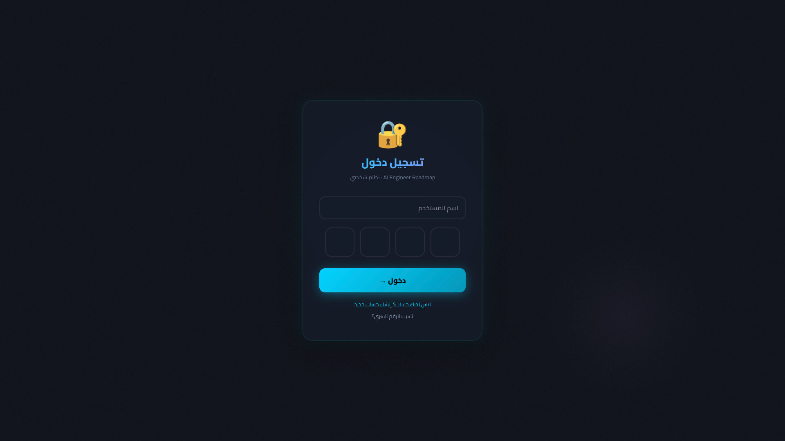
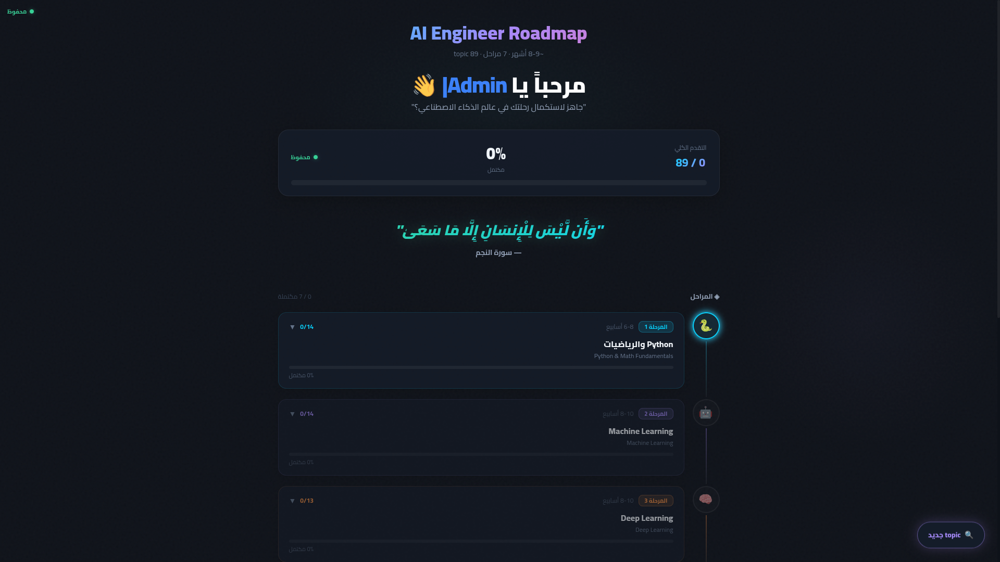
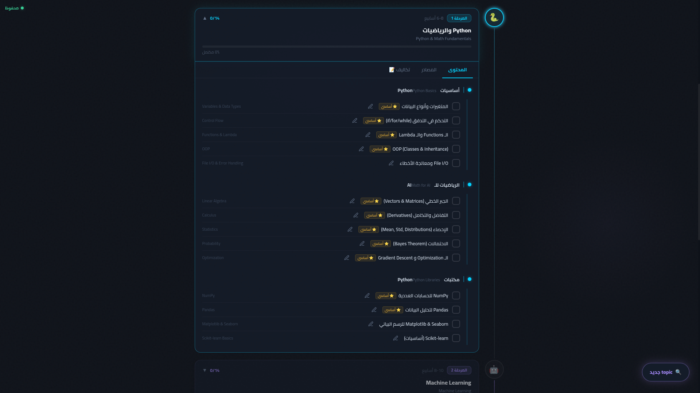

<!-- markdownlint-disable MD033 MD036 -->
# 🗺️ AI Engineer & Computer Vision Roadmap Tracker

<div align="center">


A highly personalized, real-time synchronized learning tracker designed specifically for aspiring **AI & Computer Vision Engineers**.

**🌐 [Live Demo](https://ai-engineer-roadmap-phi.vercel.app/) • [🗺️ roadmap.sh Reference](https://roadmap.sh/ai-engineer)**

</div>

---

## 📸 Screenshots

| PIN Entry | Dashboard | Phase Details |
| --------- | --------- | ------------- |
|  |  |  |

---

## ⚡ Built with Vibe Coding (AI-Assisted Engineering)

This project was architected, developed, and iteratively refined using **Vibe Coding** — an agentic AI development approach where I acted as the **Tech Lead & Systems Architect**, orchestrating AI agents to generate, debug, and refactor the codebase.

**Key Skills Demonstrated:**

- **Prompt Engineering** — Formulating highly specific, context-aware prompts for complex state management and UI/UX overhauls
- **Architectural Oversight** — Directing the AI to transition from `localStorage` to a secure, real-time Firebase Firestore database
- **Security Auditing** — Identifying and patching a PIN-collision vulnerability by introducing a Username-based auth system
- **Agent Collaboration** — Using multiple AI models (Claude + Gemini) to review code, implement `@dnd-kit` drag-and-drop, and manage the full dev lifecycle

```txt
Tools Used:
  🤖 Claude & Gemini      ← Architecture, Planning & Code Review
  🔧 Antigravity          ← Local Code Execution & Refactoring
  🎨 Figma AI             ← UI/UX Design
  🚀 Vercel               ← Automated CI/CD Deployment
```

---

## ✨ Core Features

- 🔐 **Secure Anonymous Auth** — Custom `Username + PIN + Recovery Code` system. No emails required
- 🔄 **Real-Time Sync** — Firebase Firestore keeps progress synced instantly across all devices
- 📚 **76+ Curated Resources** — Videos, books, and articles with direct links for every phase
- ✅ **Full Progress Tracking** — Checkboxes, progress bars, and completion percentages per phase
- 📝 **Topic Details** — Log Start/End dates and personal notes for every topic
- 🔀 **Drag & Drop Resources** — Reorder resources by personal priority using `@dnd-kit`
- ➕ **Custom Private Resources** — Add your own Udemy courses or playlists — visible only to you
- 💬 **Motivational Quotes** — Quranic verses and Arabic proverbs to keep you going
- ✍️ **Typewriter Welcome** — Dynamic greeting with your username on login
- 📱 **Fully Responsive** — Optimized for both mobile and desktop

---

## 🗺️ The Roadmap (7 Phases · ~8-9 Months)

```txt
Phase 1 🐍  Python & Mathematics         (6-8 weeks)
Phase 2 🤖  Machine Learning             (8-10 weeks)
Phase 3 🧠  Deep Learning                (8-10 weeks)
Phase 4 👁️  Computer Vision ⭐ Focus     (6-8 weeks)
Phase 5 🔗  AI Engineer Layer            (6-8 weeks)
Phase 6 ⚙️  MLOps & Deployment           (4-6 weeks)
Phase 7 🎯  Projects & Career            (4-6 weeks)
```

---

## 🛠️ Tech Stack

| Category | Technology |
| -------- | ---------- |
| **Frontend** | React 18 + TypeScript |
| **Build Tool** | Vite |
| **Styling** | Tailwind CSS v4 + shadcn/ui (Radix Primitives) |
| **Database** | Firebase Firestore (NoSQL, Real-time) |
| **Routing** | React Router v7 |
| **Drag & Drop** | `@dnd-kit/core` + `@dnd-kit/sortable` |
| **Animations** | `react-type-animation` + `canvas-confetti` |
| **Font** | Cairo (Google Fonts) — RTL Arabic Support |
| **Deployment** | Vercel (CI/CD via GitHub) |

---

## 🔐 Authentication System

```txt
Sign Up:
  ① Choose a unique username
  ② Set a 4-digit PIN
  ③ Save your Recovery Code (6 chars) — IMPORTANT!

Login:
  ① Enter username + PIN

Recovery:
  ① Enter username + Recovery Code
  ② Set a new PIN
```

---

## 🗄️ Firestore Data Structure

```javascript
/progress/{username}
  ├── pin: string                           // Stored PIN
  ├── recoveryCode: string                  // For account recovery
  ├── checkedTopics: { [topicId]: bool }    // Completed topics
  ├── checkedTasks: { [taskId]: bool }      // Completed tasks
  ├── customResources: { [phaseId]: [] }    // User's private resources
  ├── resourceOrder: { [phaseId]: [] }      // Custom drag-and-drop order
  └── topicDetails: {
        [topicId]: {
          startDate: string,
          endDate: string,
          note: string
        }
      }
```

---

## 🚀 Local Setup

```bash
# 1. Clone the repo
git clone https://github.com/Abdulrahman-M-Rezk/Ai-Engineer-Roadmap.git
cd Ai-Engineer-Roadmap

# 2. Install dependencies
npm install

# 3. Set up environment variables
cp .env.example .env.local
# Fill in your Firebase credentials

# 4. Run locally
npm run dev
```

**`.env.local` template:**

```env
VITE_FIREBASE_API_KEY=your_api_key
VITE_FIREBASE_AUTH_DOMAIN=your_project.firebaseapp.com
VITE_FIREBASE_PROJECT_ID=your_project_id
VITE_FIREBASE_STORAGE_BUCKET=your_project.appspot.com
VITE_FIREBASE_MESSAGING_SENDER_ID=your_sender_id
VITE_FIREBASE_APP_ID=your_app_id
```

---

## 📚 Roadmap References

| Source | Description |
| ------ | ----------- |
| [roadmap.sh/ai-engineer](https://roadmap.sh/ai-engineer) | Primary technical reference |
| [Moataz Elmesmary — DS Roadmap](https://github.com/Moataz-Elmesmary/Data-Science-Roadmap) | 4.2k ⭐ — Most comprehensive Arabic DS roadmap |
| [Mariam Ahmed — IEEE ManCSC 2025](https://github.com/Mariam-Ahmed15/Data-Science-Roadmap-IEEEManCSC-2025) | Week-by-week structured roadmap |

---

## 🤝 Connect

**Abdulrahman Rizk** — AI & Computer Vision Engineer

[](mailto:abdulrahman.m.rezk@gmail.com)
[](https://github.com/Abdulrahman-M-Rezk)

---

<div align="center">

**وَأَن لَّيْسَ لِلْإِنسَانِ إِلَّا مَا سَعَىٰ** — سورة النجم

*Made with ❤️ and ☕ in Egypt*

</div>
